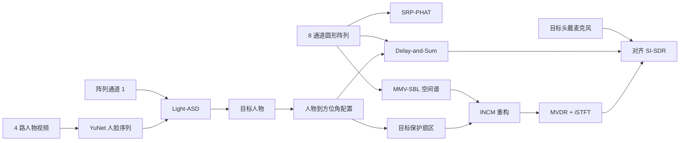

# 视听多模态目标说话人增强

多人会议中的“最强声源”不一定是系统真正想听的人。这个项目把目标选择和阵列增强拆成
两步：先通过视频判断正在说话的人，再将人物身份转换为阵列方位，完成定位和波束形成。

我使用 AMI Meeting Corpus 搭建了真实的视听多模态评测链路，包括 4 路人物视频、
8 通道圆形麦克风阵列、4 路头戴麦克风和人工标注。视觉侧使用 YuNet 与 Light-ASD，
阵列侧实现 SRP-PHAT、Delay-and-Sum，以及从窄带阵列方法扩展到宽带语音的
SBL-INCM-MVDR。

## 项目结果

### 1. 主动说话人识别

评测片段由程序根据 AMI `ES2002a` 标注自动选取，不手工筛选识别正确的样本。

| 评测范围 | Top-1 结果 |
|---|---:|
| 目标人物可见的 10 个片段 | **9 / 10** |
| 全部 16 个自动选取片段 | 9 / 16 |
| 有效视觉覆盖率 | 62.5% |

这里的 `9/10` 专指目标人物出现在近景画面中的片段。完整逐片段预测、人物可见状态、
四路候选概率和人脸检测率保存在
[`active_speaker_results.json`](artifacts/ami/active_speaker_results.json)。

### 2. +6 dB 强方向干扰

我使用两个真实 AMI 八通道房间片段构造可控空间混合：目标人物 B 位于 `14°`，
干扰人物 D 位于 `−172°`，干扰比目标强 `6 dB`。所有方法处理完全相同的八通道混合。

| 对照项 | 结果 |
|---|---:|
| 纯音频 SRP-PHAT 选择方向 | `−172°` 干扰人物 |
| Light-ASD 视觉目标方向 | `14°` 目标人物 |
| 视觉目标 + Delay-and-Sum | **+2.20 dB SI-SDR** |
| 视觉目标 + SBL-INCM-MVDR | **+2.15 dB SI-SDR** |

两种视觉引导后端都获得约 2.2 dB 的相对收益，说明人物身份先验能够在强干扰下完成
目标消歧，并将阵列指向保持在目标人物方向。完整参数和逐方法结果保存在
[`interference_results.json`](artifacts/ami/interference_results.json)。

### 3. AISHELL-4 真实八通道补充实验

为了验证阵列后端在另一套真实圆阵语料上的表现，我在 AISHELL-4 的 15 场留出会议上
进行了中文 ASR 评测：

| 前端 | 平均 CER |
|---|---:|
| 单通道 channel 0 | 43.67% |
| Delay-and-Sum | 38.88% |
| SBL-INCM，置信度自适应扇区 | 38.94% |
| 置信度门控 DS / SBL-INCM | **38.78%** |

置信度门控方法相对单通道的 CER 降低 **11.20%**。逐会议结果保存在
[`heldout_15_metrics.json`](artifacts/aishell4_batch/heldout_15_metrics.json)，实验说明见
[`REAL_DATA_AISHELL4.md`](docs/REAL_DATA_AISHELL4.md)。

## 处理链路



SBL-INCM-MVDR 的宽带语音实现包括：

- 在 STFT 频点上使用 MMV-SBL 估计稀疏空间功率；
- 根据视觉目标方向建立保护扇区；
- 在目标扇区外筛选干扰方向并重构干扰加噪声协方差；
- 通过对角加载求解 MVDR 权重；
- 使用 iSTFT 恢复宽带语音。

核心代码位于
[`src/cabin_speech/sbl_mvdr.py`](src/cabin_speech/sbl_mvdr.py)，算法公式与函数对应关系见
[`docs/SBL_INCM_SPEECH.md`](docs/SBL_INCM_SPEECH.md)。

## 可运行入口

### 摄像头 + 普通麦克风实时演示

实时入口适配普通摄像头和单麦克风，提供能量 VAD、人脸跟踪、嘴部运动、画外说话人提示
和可选 Whisper 字幕：

```powershell
python -m cabin_speech demo
python -m cabin_speech demo --enable-asr
```

### AMI 八通道多模态评测

AMI 入口运行 Light-ASD、SRP-PHAT 和八通道波束形成：

```powershell
python -m cabin_speech evaluate-active-speaker
python -m cabin_speech evaluate-interference
```

### 结果校验

```powershell
python -m cabin_speech verify-results
```

实时入口用于展示视听交互，AMI 和 AISHELL-4 入口用于评测多通道阵列算法。两套离线
评测共用阵列几何、定位、波束形成和指标模块。

## 安装

项目使用 Python 3.11。我在 Windows 和 NVIDIA RTX 50 系列显卡环境中开发。建议先根据
[PyTorch 官方安装说明](https://pytorch.org/get-started/locally/)安装匹配显卡的 CUDA 版本，
再安装项目依赖：

```powershell
conda create -n cabin_avspeech python=3.11 pip -y
conda activate cabin_avspeech
python -m pip install -e ".[dev,demo,asr,evaluation]"
```

运行代码检查和测试：

```powershell
ruff check .
pytest
```

## 数据准备

AMI 数据目录：

```text
data/raw/ami/
├── ES2002a/
│   ├── audio/
│   │   ├── ES2002a.Array1-01.wav ... ES2002a.Array1-08.wav
│   │   └── ES2002a.Headset-0.wav ... ES2002a.Headset-3.wav
│   └── video/
│       └── ES2002a.Closeup1.avi ... ES2002a.Closeup4.avi
└── annotations/manual_1.6.2/
```

还需要：

- [Light-ASD](https://github.com/Junhua-Liao/Light-ASD) 及其公开预训练权重；
- [OpenCV Zoo YuNet](https://github.com/opencv/opencv_zoo/tree/main/models/face_detection_yunet)；
- [`configs/ami_es2002a.yaml`](configs/ami_es2002a.yaml) 中的数据路径和人物方位角配置。

语料、第三方仓库和模型权重按各自许可单独下载，仓库保存源码、配置和可核对的小型结果文件。
详细步骤见 [`REAL_MULTIMODAL_AMI.md`](docs/REAL_MULTIMODAL_AMI.md)。

## 代码入口

| 内容 | 代码 |
|---|---|
| YuNet 与 Light-ASD 适配 | [`active_speaker.py`](src/cabin_speech/active_speaker.py) |
| AMI 标注与人物映射 | [`annotations.py`](src/cabin_speech/annotations.py) |
| 多通道数据读取 | [`datasets.py`](src/cabin_speech/datasets.py) |
| SRP-PHAT | [`localization.py`](src/cabin_speech/localization.py) |
| Delay-and-Sum | [`audio.py`](src/cabin_speech/audio.py) |
| SBL、INCM 与 MVDR | [`sbl_mvdr.py`](src/cabin_speech/sbl_mvdr.py) |
| 实时 VAD 与视听融合 | [`realtime.py`](src/cabin_speech/realtime.py) |
| 强干扰实验 | [`evaluate_ami_interference.py`](scripts/evaluate_ami_interference.py) |
| 完整模块数据流 | [`ARCHITECTURE.md`](docs/ARCHITECTURE.md) |

## 数据集与方法来源

- [AMI Meeting Corpus](https://groups.inf.ed.ac.uk/ami/corpus/)
- [AISHELL-4 / OpenSLR SLR111](https://www.openslr.org/111/)
- [Light-ASD](https://github.com/Junhua-Liao/Light-ASD)
- [OpenCV Zoo YuNet](https://github.com/opencv/opencv_zoo/tree/main/models/face_detection_yunet)
- [SBL-INCM-MVDR 论文](https://doi.org/10.1016/j.dsp.2026.106138)

第三方资源和许可信息见 [`docs/THIRD_PARTY.md`](docs/THIRD_PARTY.md)。
