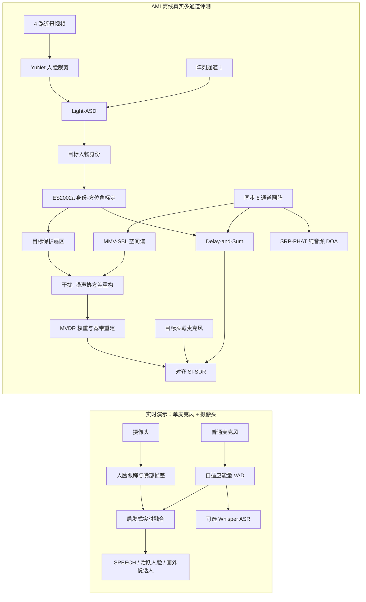

# 视听多模态目标说话人感知与阵列语音前端

一个面向音频算法、阵列信号处理和多模态感知岗位的可复现实验项目：利用视觉主动说话人先验解决强方向干扰下的目标身份歧义，并引导 8 通道阵列定位与波束形成。

> 当前边界：摄像头 + 单麦克风链路可实时演示；AMI 8 通道阵列链路为离线评测。项目不是“实时八通道车载系统”，也没有在完整 AMI 数据集上训练或评测。

## 项目解决的问题

纯音频阵列通常会把能量最强的声源当成目标。当非目标说话人更响时，SRP-PHAT 可能准确地定位到一个声源，却选错“应该增强的人”。本项目把问题拆为两层：

1. 视觉与语音共同判断当前目标人物是谁；
2. 将人物身份映射为阵列方位角，再执行 Delay-and-Sum 或 SBL-INCM-MVDR。

因此核心贡献不是宣称某个波束形成器全面优于其他方法，而是验证视觉语义先验能够在声学目标选择失效时完成身份消歧。

## 核心技术亮点

- 接入 AMI `ES2002a` 的同步 8 通道圆阵、4 路近景视频、4 路头戴麦克风和人工标注；
- 使用 OpenCV YuNet 检测人脸，使用 CVPR 2023 Light-ASD 进行音视频主动说话人推理；
- 实现 SRP-PHAT、分数延时 Delay-and-Sum、MMV-SBL 空间谱、INCM 重构和 MVDR 权重求解；
- 将 Light-ASD 结果 JSON 中的目标身份映射为会议专用阵列方位角，形成可审计的数据链；
- 同时报告全量准确率、目标可见子集准确率、视觉覆盖率和失败案例；
- 在可控的真实房间空间混合中验证强干扰下的多模态收益；
- 保留单麦克风实时 Demo，用于 VAD、人脸/嘴部运动、画外说话人提示及可选 Whisper ASR；
- 适配 Windows/PowerShell，路径均可通过配置或命令行覆盖，原始数据和模型权重不进入仓库。

## 系统架构



更详细的函数、数组形状和模块边界见 [架构说明](docs/ARCHITECTURE.md)。

## 两条运行链路

### 1. 实时演示：普通摄像头 + 单麦克风

入口为 `scripts/webcam_mic_demo.py`：

- `AdaptiveEnergyVAD` 输出全局语音概率；
- `FaceMouthMotionTracker` 使用 Haar 人脸框、简单 IoU 跟踪和嘴部帧差；
- `live_fusion_probabilities` 将语音概率分配给可见人脸或 `off_camera`；
- 可选 `WhisperASR` 在后台生成字幕。

单麦克风不能可靠估计方位角，所以该链路不运行 SRP-PHAT、Delay-and-Sum 或 MVDR。它也没有使用离线评测中的 Light-ASD。

```powershell
python -m cabin_speech demo
python -m cabin_speech demo --enable-asr
```

### 2. AMI 离线评测：4 路视频 + 8 通道阵列

主动说话人阶段读取同一时间区间的阵列通道 1 和四路人脸序列，结果写入
`artifacts/ami/active_speaker_results.json`。强干扰阶段读取该 JSON 的预测身份，使用
`configs/ami_es2002a.yaml` 中的会议专用身份—方位角标定，再处理全部 8 个阵列通道。

这里的方位角映射是基于孤立标注语音得到的 ES2002a 专用经验标定，不是通用的“人脸像素坐标直接回归 DOA”模型。

## 已验证实验结果

### 主动说话人识别

自动从人工标注中选择 2–8 秒、有词汇内容且无其他说话人重叠的 16 个片段：

| 评测范围 | 正确数 | Top-1 准确率 |
|---|---:|---:|
| 全部 16 个自动选取片段 | 9 / 16 | 56.25% |
| 目标脸检测率 ≥ 50% 的可见片段 | 9 / 10 | 90.00% |
| 四人随机选择参考 | — | 25.00% |

视觉有效覆盖率为 `10 / 16 = 62.50%`。`90%` 只适用于目标人物可见的 10 个片段，不能描述为完整 AMI 或全部 16 个片段的准确率。

证据：[active_speaker_results.json](artifacts/ami/active_speaker_results.json)

### +6 dB 强方向干扰案例

该实验把两个不同时间的真实 AMI 8 通道房间录音进行可控叠加：

- 目标 B：`465.488–470.488 s`，标定方向 `14°`；
- 干扰 D：`499.136–504.136 s`，标定方向 `−172°`；
- 干扰相对目标强 `6 dB`。

它保留了真实多通道房间传递特性，但不是会议中自然发生的同步重叠语音。纯音频 SRP-PHAT 被强干扰带到 `−172°`；持久化的 Light-ASD 结果选择 B，因而视觉链路仍使用 `14°`。

| 前端 | 对齐 SI-SDR | 相对纯音频 DOA + DS |
|---|---:|---:|
| 单通道 | -12.37 dB | -0.06 dB |
| 纯音频 DOA + Delay-and-Sum | -12.31 dB | 基线 |
| 视觉目标 + Delay-and-Sum | -10.11 dB | **+2.20 dB** |
| 视觉目标 + SBL-INCM-MVDR | -10.17 dB | **+2.15 dB** |

由于参考是近讲头戴麦克风、估计是远场阵列输出，绝对 SI-SDR 受不同传递函数影响；这里比较同一参考和同一对齐方法下的相对变化。

证据：[interference_results.json](artifacts/ami/interference_results.json)

## SBL-INCM-MVDR 的实际作用

`wideband_sbl_mvdr` 对 STFT 频点执行以下处理：

1. `run_mmv_sbl` 在角度字典上估计稀疏空间功率和噪声方差；
2. `reconstruct_incm_mvdr` 排除视觉目标保护扇区，筛选主要干扰方向并重构 INCM；
3. 通过对角加载和闭式 MVDR 求解空间权重；
4. 经 iSTFT 重建宽带语音。

强干扰实验为控制计算量设置 `frequency_stride=2`：被选中的频点运行 SBL-INCM-MVDR，其余频点回退到视觉 Delay-and-Sum。因此该结果是加速的宽带混合实现，不应描述为每个频点都完成了 SBL 优化。

两种视觉引导后端在当前单个压力案例中的结果接近。现有证据用于验证视觉目标扇区能够进入 SBL-INCM-MVDR 并参与最终重建，不对波束形成后端作普适性能排序。论文方法与代码映射见 [SBL-INCM 说明](docs/SBL_INCM_SPEECH.md)。

## 当前局限

- 仅评测一场 AMI 会议、16 个孤立片段，可见子集只有 10 个，不是标准大规模 benchmark；
- 视觉覆盖率只有 62.5%，人物离开近景摄像头时无法获得有效视觉先验；
- ES2002a 身份—角度映射是会议专用经验标定，尚未实现相机外参驱动的通用几何映射；
- 强干扰样本由两个真实房间片段可控叠加，不是自然同步重叠对话；
- Light-ASD 权重直接使用公开预训练模型，未在 AMI 上微调；
- 干扰实验中的波束形成置信度固定为 0.90，用于保持 pilot 设置；它没有从 Light-ASD 原始概率完成校准；
- SBL 在该 pilot 设置下达到最大迭代数，尚需研究收敛阈值、初始化和频点并行化；
- 当前没有完整报告 WER、STOI、PESQ、置信区间和统计显著性；
- 实时链路只有单麦克风，不包含实时阵列采集、实时 DOA 或实时 MVDR；
- 与雷达岗位相关的是阵列流形、稀疏角谱、INCM 和 MVDR 方法迁移；项目没有实现雷达距离—多普勒处理、检测或跟踪。

## 环境安装

推荐 Python 3.11。RTX 50 系列 Windows 环境可先安装适配显卡的 PyTorch CUDA wheel，再安装项目依赖：

```powershell
conda create -n cabin_avspeech python=3.11 pip -y
conda activate cabin_avspeech

# 示例版本；如 PyTorch 官方安装页已有更新，应以官方命令为准。
python -m pip install torch==2.11.0 torchvision==0.26.0 torchaudio==2.11.0 `
  --index-url https://download.pytorch.org/whl/cu130

python -m pip install -e ".[dev,demo,asr,evaluation]"
```

也可以使用：

```powershell
conda env create -f environment.yml
conda activate cabin_avspeech
```

仅运行单元测试不需要下载 AMI、YuNet 或 Light-ASD 权重。

## 数据与模型准备

大型数据、第三方仓库和模型权重均被 `.gitignore` 排除。

### AMI ES2002a

从 [AMI Corpus](https://groups.inf.ed.ac.uk/ami/corpus/) 获取 `ES2002a`，整理为：

```text
data/raw/ami/
├── ES2002a/
│   ├── audio/
│   │   ├── ES2002a.Array1-01.wav ... ES2002a.Array1-08.wav
│   │   └── ES2002a.Headset-0.wav ... ES2002a.Headset-3.wav
│   └── video/
│       └── ES2002a.Closeup1.avi ... ES2002a.Closeup4.avi
└── annotations/manual_1.6.2/
    ├── corpusResources/meetings.xml
    ├── segments/
    └── words/
```

### Light-ASD

```powershell
git clone --depth 1 https://github.com/Junhua-Liao/Light-ASD.git `
  data/raw/third_party/Light-ASD
```

确认以下权重存在：

```text
data/raw/third_party/Light-ASD/weight/pretrain_AVA_CVPR.model
```

### YuNet

下载 OpenCV Zoo 的 `face_detection_yunet_2023mar.onnx`：

```powershell
New-Item -ItemType Directory -Force data/raw/models | Out-Null
Invoke-WebRequest `
  https://media.githubusercontent.com/media/opencv/opencv_zoo/main/models/face_detection_yunet/face_detection_yunet_2023mar.onnx `
  -OutFile data/raw/models/face_detection_yunet_2023mar.onnx
```

如目录不同，可修改 [AMI 配置](configs/ami_es2002a.yaml) 或使用评测脚本的路径参数。

## 一键运行

统一轻量入口使用实际包名 `cabin_speech`：

```powershell
# 实时单麦克风 Demo
python -m cabin_speech demo

# 先生成主动说话人结果
python -m cabin_speech evaluate-active-speaker

# 再读取上述结果，运行 8 通道强干扰实验
python -m cabin_speech evaluate-interference

# 不需要原始数据，检查两个已保存 JSON 的内部一致性和数据血缘
python -m cabin_speech verify-results

# 单元测试
python -m cabin_speech test
```

参数会原样转发，例如：

```powershell
python -m cabin_speech demo --camera-index 1 --audio-device 2 --enable-asr
python -m cabin_speech evaluate-interference --interference-db 6
```

原脚本入口仍然保留：

```powershell
python scripts/evaluate_ami_active_speaker.py --config configs/ami_es2002a.yaml
python scripts/evaluate_ami_interference.py --config configs/ami_es2002a.yaml
```

## 代码质量

```powershell
ruff check .
pytest
```

## 目录结构

```text
configs/
  ami_es2002a.yaml              # AMI 路径、阵列、角度标定和实验参数
docs/
  ARCHITECTURE.md               # 模块、函数和数据格式
  REAL_MULTIMODAL_AMI.md        # 真实多模态实验报告
  RESUME_PROJECT.md             # 中英文简历与面试材料
scripts/
  webcam_mic_demo.py            # 单麦克风实时演示
  evaluate_ami_active_speaker.py
  evaluate_ami_interference.py
src/cabin_speech/
  active_speaker.py             # YuNet 裁剪与 Light-ASD 适配
  annotations.py                # AMI / TextGrid 标注解析
  datasets.py                   # 多通道与同步单声道加载
  localization.py               # SRP-PHAT
  sbl_mvdr.py                   # SBL、INCM、MVDR 与宽带重建
  realtime.py                   # 实时 VAD、分段和启发式融合
tests/                           # 单元测试
artifacts/ami/*.json            # 可提交的小型评测证据
data/raw/                        # 不提交的数据和权重
```

## 数据集、模型与论文致谢

- [AMI Meeting Corpus](https://groups.inf.ed.ac.uk/ami/corpus/)：真实同步会议音视频与标注；
- [AMI Signals](https://groups.inf.ed.ac.uk/ami/corpus/signals.shtml)：阵列与录制信号说明；
- [Light-ASD](https://github.com/Junhua-Liao/Light-ASD)：CVPR 2023 轻量主动说话人模型，MIT License；
- [OpenCV Zoo YuNet](https://github.com/opencv/opencv_zoo/tree/main/models/face_detection_yunet)：人脸检测模型；
- [Sparse Bayesian learning for interference-plus-noise covariance matrix reconstruction in robust MVDR beamforming](https://doi.org/10.1016/j.dsp.2026.106138)：SBL-INCM-MVDR 方法依据；
- [AISHELL-4 / OpenSLR SLR111](https://www.openslr.org/111/)：仓库中另有音频-only 真实多通道探索实验。

完整第三方资源和许可说明见 [第三方说明](docs/THIRD_PARTY.md)。

求职表述、30 秒/1 分钟/3 分钟介绍及常见追问见 [求职展示文档](docs/RESUME_PROJECT.md)。
